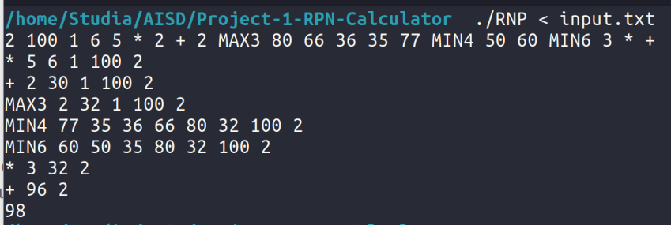

# Reverse polish notation calculator

A project for college.<br>
Gdańsk University of Technology 2024, algorithms and data structures



## Description
The program allows you to convert basic mathematical operations into postfix form and calculate its value.

## Input
* Count of formulas
* N formulas (each token should be separated by a space and the expression should end with a dot (see [example](input.txt)))

## Output
* Postfix notation
* The contents of the stack after each operation
* Result

## Supported operations

| Operation | Description |
|-----------|-------------|
| +         | Addition    |
| -         | Subtraction |
| /         | Division    |
| *         | Multiplication |
| ()        | Priority |
| MIN       | Minimum value |
| MAX       | Maximum value |
| N         | Negation    |
| IF        | Conditional statement ( IF ( a , b , c) - IF a > 0 returns b, otherwise c ) |

### Examples
* N ( ( MAX ( 0 , 1 ) + N ( 1 ) ) ) .
* N IF ( IF ( 8 , 9 , 6 ) , ( 1 * 2 ) , N 4 ) .
* ( 5 - 4 ) / N 4 / N ( 0 + 9 ) .

## Diving by 0
When you try to divide by zero, the program will return ERROR

## MIN, MAX
In the output, MIN and MAX will be presented with the number of arguments it accepts, e.g. MAX ( 1 , 3 , 5 ) -> MAX3

## Compilation and running
```g++ *.cpp *.h -o RNP && ./RNP < input.txt```